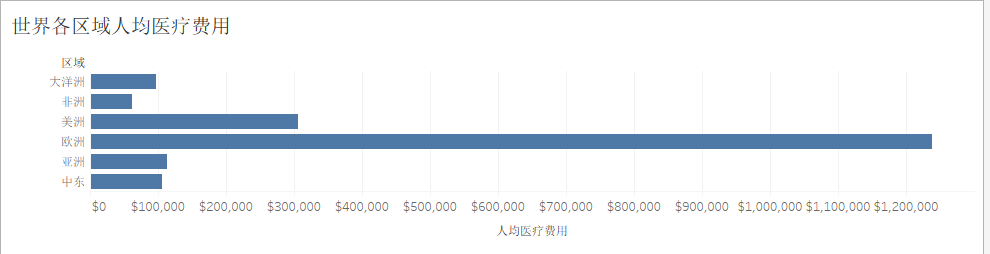

# 让人混乱的水平条形图和垂直条形图

#### 长（高）度和宽度
* 水平条形图是用条形的长度表示各类别频数的多少,其宽度(表示类别)则是固定的;   
* 垂直条形图是用面积表示各组频数的多少，矩形的高度表示每一组的频数或频率，宽度则表示各组的组距，因此其高度与宽度均有意义。
#### 横轴
* 水平条形图中，横轴上的数据是孤立的，是一个具体的数据。

 * 垂直条形图中，横轴上的数据是连续的，是一个范围，如下图横轴代表的年份。

#### 类型
* 水平条形图主要用于展示分类数据
* 垂直条形图则主要用于展示数值型数据